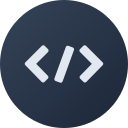

	
	<h1>WebToys</h1>

## what is it?

A handy and easy-to-use collection of tools every developer needs at one point or another. It's a web-based implementation of [DevToys](https://github.com/veler/DevToys) built with Next.js.

## why?

Because not everyone is a Windows user :)

## status

WebToys is in the very early stages of development. Most tools are not implemented. I am aiming for 1:1 feature parity with DevToys eventually, wherever that's feasible.

Below is a list of things to do; feel free to contribute if any of them appeal to you!

### features

- [x] responsive navigation drawer
- [ ] tools
  - [ ] converters
    - [ ] json to yaml
    - [x] number base
  - [ ] encoders & decoders
    - [x] html entities
    - [x] url
    - [x] base 64
    - [ ] gzip
    - [x] json web token
  - [ ] formatters
    - [ ] json
    - [ ] sql
    - [ ] xml
  - [ ] generators
    - [x] hash
    - [ ] uuid
    - [x] lorem ipsum
    - [ ] checksum
  - [ ] text
    - [ ] inspector / case converter
    - [ ] regex tester
    - [ ] text diff
    - [ ] markdown preview
  - [ ] graphic (use `sharp` maybe?)
    - [ ] color blindness simulator
    - [ ] png & jpeg compressor
    - [ ] image converter
- [ ] syntax highlighting and line numbering for code-related tools
- [ ] search
- [ ] translations
- [ ] automatically save preferences with cookies

### code maintenance

- [x] generalize components like buttons and sections for quick reusability
- [ ] make `className`s easier to read
- [ ] write type declarations where needed so that it can build
  - [ ] component props
  - [ ] helper functions
- [ ] remove unused imports (mdi icon paths, for example)
- [ ] ensure responsiveness on every component
- [ ] ensure accessibility on every component
- [ ] ensure everything looks good in light and dark mode
- [ ] test PWA and make sure it works offline
